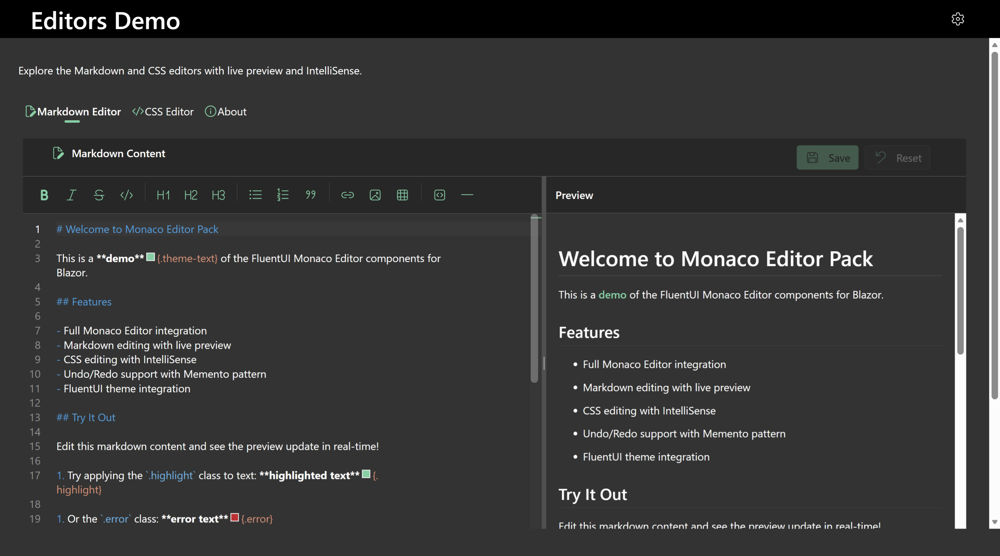
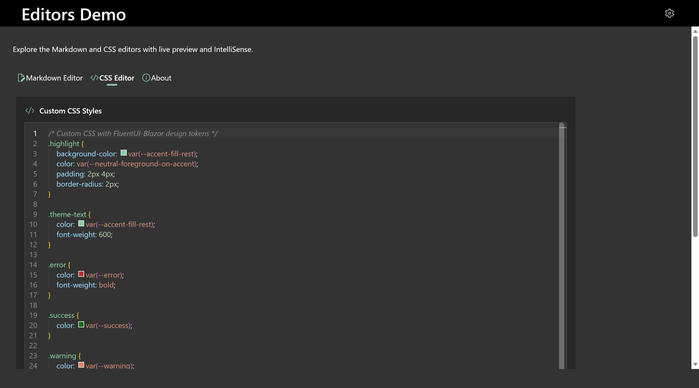

# FluentUI Blazor Monaco Editor Pack

Monaco Editor integration for Blazor with FluentUI components - includes Markdown and CSS editors with IntelliSense, live preview, and theme integration.

[](https://www.nuget.org/packages/FluentUI.Blazor.Monaco.EditorPack/)

## Live Demo

### **[Try the interactive demo](https://gerfen.github.io/FluentUI.Blazor.Monaco.EditorPack/)**


## Screenshots






## Features

- **Markdown Editor** - Live preview, CSS class IntelliSense, toolbar, undo/redo
- **CSS Editor** - FluentUI design token IntelliSense, color swatches, auto-completion
- **Theme Integration** - Automatic dark/light mode support
- **Monaco lifecycle hooks (Markdown)** - Run code *before* Monaco is created and *after* the editor instance is available
- **Configurable Markdig pipeline (Markdown)** - Toggle common Markdig extensions via `MarkdownOptions`


## Quick Start

### 1. Install Package

```bash
dotnet add package FluentUI.Blazor.Monaco.EditorPack
```

### 2. Register Services

Add to `Program.cs`:

```csharp
builder.Services.AddMonacoEditorPack();
builder.Services.AddFluentUIComponents();
```

### 3. Add Scripts

**Blazor Server** (`App.razor`):
```html
<body>
    <FluentDesignTheme StorageName="theme" />
    <Routes @rendermode="new InteractiveServerRenderMode(prerender: true)" />
    <script src="_framework/blazor.web.js"></script>
    
    <!-- Monaco Editor Scripts -->
    <script src="_content/FluentUI.Blazor.Monaco.EditorPack/lib/monaco-editor/min/vs/loader.js"></script>
    <script src="_content/FluentUI.Blazor.Monaco.EditorPack/js/monaco-editor-pack.js"></script>
</body>
```

**Blazor WebAssembly** (`index.html`):
```html
<body>
    <div id="app">...</div>
    <script src="_framework/blazor.webassembly.js"></script>
    
    <!-- Monaco Editor Scripts -->
    <script src="_content/FluentUI.Blazor.Monaco.EditorPack/lib/monaco-editor/min/vs/loader.js"></script>
    <script src="_content/FluentUI.Blazor.Monaco.EditorPack/js/monaco-editor-pack.js"></script>
</body>
```

### 4. Use Components

**Markdown Editor:**
```razor
<MonacoMarkdownEditor @ref="editor"
                      Markdown="@content"
                      MarkdownChanged="@OnChanged" />

@code {
    private MonacoMarkdownEditor? editor;
    private string content = "# Hello World";
    
    private Task OnChanged(string newContent)
    {
        content = newContent;
        return Task.CompletedTask;
    }
}
```

**Configure Markdig switches (Markdown preview):**

`MonacoMarkdownEditor` uses Markdig to render the live preview. You can toggle common Markdig extensions by providing `MarkdownOptions`.

```razor
@using FluentUI.Blazor.Monaco.EditorPack.Markdown

<MonacoMarkdownEditor Markdown="@content"
                      MarkdownChanged="@OnChanged"
                      MarkdownOptions="@options" />

@code {
    private string content = "# Hello World";

    private readonly MarkdownOptions options = new()
    {
        EnableFrontMatter = true,
        EnableTables = true,
        EnableGridTables = false,
        EnableTaskLists = true,
        EnableFootnotes = false,
        EnableGenericAttributes = true,
        EnableAutoIdentifiers = true,
        EnableAutoLinks = true,
        EnableSmartyPants = false,
        EnableFigures = false,
        EnableEmphasisExtras = true,
        EnableListExtras = true,
        EnableFencedCodeBlocks = true
    };

    private Task OnChanged(string newContent)
    {
        content = newContent;
        return Task.CompletedTask;
    }
}
```

**Monaco lifecycle hooks (Markdown Editor):**

`MonacoMarkdownEditor` exposes two optional hooks:

- `OnBeforeMonacoCreated`: called once before the JS `init` creates Monaco. Use this to register languages, configure global Monaco settings, etc.
- `OnMonacoInitialized`: called once after Monaco is initialized and the editor instance is available.

```razor
<MonacoMarkdownEditor Markdown="@content"
                      MarkdownChanged="@OnChanged"
                      OnBeforeMonacoCreated="@BeforeCreated"
                      OnMonacoInitialized="@AfterInitialized" />

@code {
    private string content = "# Hello World";

    private Task OnChanged(string newContent)
    {
        content = newContent;
        return Task.CompletedTask;
    }

    private Task BeforeCreated(IJSRuntime js)
    {
        // Use JS interop to set up Monaco before creation (languages, themes, etc.)
        return Task.CompletedTask;
    }

    private Task AfterInitialized(IJSObjectReference editor)
    {
        // JS editor instance is available (set options, add actions, etc.)
        return Task.CompletedTask;
    }
}
```

**CSS Editor:**
```razor
<MonacoCssEditor @ref="cssEditor"
                 Css="@cssContent"
                 CssChanged="@OnCssChanged" />

@code {
    private MonacoCssEditor? cssEditor;
    private string cssContent = ".my-class { color: var(--accent-fill-rest); }";
    
    private Task OnCssChanged(string newCss)
    {
        cssContent = newCss;
        return Task.CompletedTask;
    }
}
```

## Detailed Setup

- **Blazor Server**: See [Demo App Setup Guide](https://github.com/gerfen/FluentUI.Blazor.Monaco.EditorPack/blob/master/FluentUI.Blazor.Monaco.EditorPack.DemoApp/wwwroot/SETUP_GUIDE.md)
- **Blazor WebAssembly**: See [WASM Demo Setup Guide](https://github.com/gerfen/FluentUI.Blazor.Monaco.EditorPack/blob/master/FluentUI.Blazor.Monaco.EditorPack.WasmDemo/wwwroot/SETUP_GUIDE.md)


## Requirements

- .NET 9.0 or .NET 10.0
- Microsoft.FluentUI.AspNetCore.Components 4.13.2+


## License

MIT License - see [LICENSE](LICENSE.txt)
